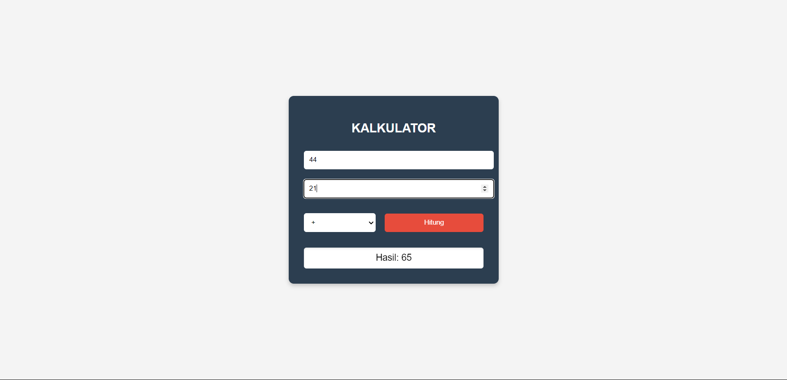

# Kalkulator

Aplikasi kalkulator sederhana berbasis web yang dibangun menggunakan HTML, CSS, dan PHP.

## Daftar Isi

- [Pendahuluan](#pendahuluan)
- [Fitur](#fitur)
- [Teknologi yang Digunakan](#teknologi-yang-digunakan)
- [Instalasi](#instalasi)

## Pendahuluan

**Kalkulator** adalah aplikasi web sederhana yang memungkinkan pengguna untuk melakukan perhitungan matematika dasar seperti penjumlahan, pengurangan, perkalian, dan pembagian. Aplikasi ini dirancang dengan antarmuka yang bersih dan mudah digunakan.

## Fitur

- Penjumlahan
- Pengurangan
- Perkalian
- Pembagian
- Desain responsif yang dapat digunakan di perangkat seluler dan desktop



## Teknologi yang Digunakan

- **HTML** - Untuk struktur aplikasi web
- **CSS** - Untuk desain dan tata letak
- **PHP** - Untuk logika backend dalam melakukan perhitungan

## Instalasi

1. Clone repositori ini ke direktori lokal:
   ```bash
   git clone https://github.com/username/kalkulator.git
